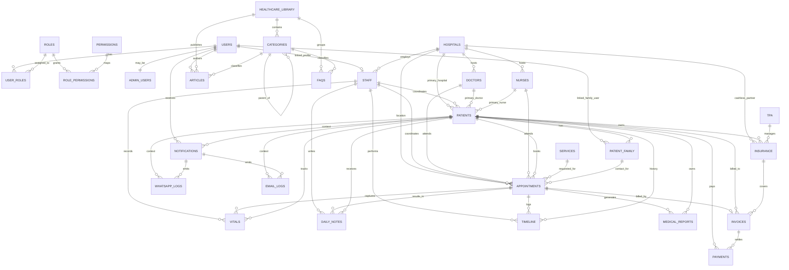

# InstantCare PostgreSQL Design

This schema is designed for Supabase PostgreSQL, uses UUID primary keys throughout, keeps operational healthcare data relational, and leaves room for future row-level security and storage policies without requiring third-party integration now.

## ER Diagram

## Design Explanation

### Identity and access

- `users` is the application-level identity table. It includes `auth_user_id` so you can attach each profile to Supabase Auth later without redesigning the schema.
- `roles`, `permissions`, `role_permissions`, and `user_roles` implement backend-friendly RBAC. This is more flexible than storing a single role string on the user row.
- `admin_users` is a focused extension table for privileged users instead of overloading the base user profile with admin-only fields.

### Care operations

- `patients` is the hub of the healthcare domain. It connects to a primary doctor, nurse, hospital, and coordinator, while preserving independent appointment history.
- `patient_family` is a proper child table because one patient can have many NRI relatives, decision makers, and emergency contacts.
- `staff` is the internal workforce base. `doctors` and `nurses` are specialized tables so external consultants can exist without forcing every clinician into the same shape.
- `appointments` sits in the middle of service delivery and ties together patient, service, hospital, clinician, nurse, coordinator, and family contact.

### Financial and insurance flow

- `insurance` stores patient policy or claim context, with an optional link to `tpa` and `hospitals` for cashless processing.
- `invoices` and `payments` are intentionally separated so one invoice can be settled through multiple payment attempts or partial collections.
- The invoice table also accepts an optional insurance link so insurer-covered and self-pay flows can coexist.

### Clinical records

- `medical_reports`, `vitals`, `daily_notes`, and `timeline` are split into separate tables because they grow at different rates and are queried differently.
- `timeline` acts as the cross-cutting event ledger for portal views, audit traces, and patient history feeds.
- `medical_reports` stores Supabase Storage metadata instead of binary files, which is the correct pattern for Supabase.

### Communications

- `notifications` is the canonical outbound message table with shared channel and delivery status fields.
- `whatsapp_logs` and `email_logs` extend notifications with channel-specific payload and provider response tracking.
- This structure supports future retries, observability, and compliance reporting without mixing channel-specific fields into one table.

### Content system

- `healthcare_library` is the top-level content container.
- `categories` supports nesting through `parent_category_id` so the knowledge base can scale beyond a flat taxonomy.
- `articles` and `faqs` remain separate because they have different publishing, search, and rendering needs.

## Optimization Notes

- Every table uses UUID keys via `gen_random_uuid()`.
- Foreign keys that are used in dashboards and timeline views are indexed.
- Composite indexes target real query paths such as appointment calendar views, patient vitals history, invoice follow-ups, and recipient notification feeds.
- JSONB columns are used only for optional or evolving metadata so core relationships remain relational and queryable.
- `updated_at` is maintained through a shared trigger function for consistency.

## Supabase Readiness

- The schema is safe to use as a starting migration in Supabase.
- `auth_user_id` on `users` prepares for Supabase Auth without forcing that integration today.
- Storage-facing tables store file metadata and paths rather than blobs.
- RLS policies are intentionally not added yet because access rules should be applied after the final auth and tenancy model is confirmed.